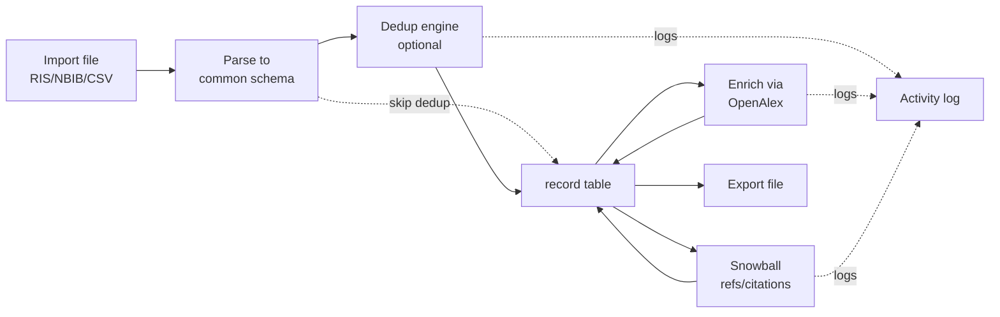

# srdatatools — Design Document

2026-09-18 · Emily

**srdatatools** is a local, open-source (MIT licensed), single-user desktop application for importing, merging, deduplicating, enriching, and exporting collections of academic paper metadata from multiple sources (RIS, NBIB, CSV, OpenAlex).

## Goals & scope

**Primary user:** researchers/students doing systematic reviews or literature management who want a free, local, open-source alternative to juggling exports from multiple databases by hand. This is a tool-first build — there's no single project driving it on a deadline — informed by having helped various people with exactly this kind of literature-wrangling problem before. Because there's no deadline pressure, correctness and robustness take priority over shipping speed: solid tests, clear data provenance, and reversible operations (see Data model) matter more than getting to a demo fast.

**v1 goals:**

- Import bibliographic records from RIS, NBIB (PubMed), and CSV files
- Store everything in one local database so multiple source files can be combined without duplicate entries
- Deduplicate records across sources (same paper appearing in e.g. both a PubMed and a Scopus export)
- Export the combined, cleaned collection to a new file (RIS/CSV at minimum)
- A GUI for import/export and dataset statistics (counts, sources, years, dedup results)
- Full transparency: every action (import, merge, dedup decision, enrichment) is logged and visible to the user
- Enrich records with metadata from OpenAlex (abstracts, citation counts, open-access links, missing fields)
- Snowballing: pull references/citations of a paper to discover related work

**Target scale:** libraries up to tens of thousands of records. This is large enough that naive all-pairs fuzzy matching (comparing every record to every other) becomes too slow, so dedup needs a blocking/indexing strategy rather than a brute-force approach (see Deduplication under Core workflows).

**Explicitly out of scope for v1** (candidates for later):

- Multi-user / shared database, cloud sync
- PDF full-text storage or full-text search
- Screening/tagging workflow for systematic reviews (inclusion/exclusion, PRISMA)
- Reference-manager integrations (Zotero/Mendeley sync)
- Non-English source format support beyond what RIS/NBIB/CSV already carry
- Multiple separate library files / switchable "projects" — one fixed database in the app-data folder for v1
- Backup/restore or a full-database export feature — bibliographic export is the only backup mechanism

## Source database priority

Goal: support as many databases as possible, built in order of how widely used they are. Starting six:

| Priority | Database | Native export format(s) | Notes / quirks |
| --- | --- | --- | --- |
| 1 | PubMed | NBIB, MEDLINE (.txt) | Well-structured tags; NBIB parser already planned |
| 2 | Scopus | CSV, RIS | CSV column names differ from other vendors; export field set is configurable by the user in Scopus itself, so mapping must be flexible, not fixed |
| 3 | Web of Science | RIS, "Plain Text" tagged format | WoS's own tagged format uses different two-letter tags than standard RIS in places; RIS export is more standard and likely the safer first target |
| 4 | IEEE Xplore | CSV, RIS, BibTeX | CSV export is common for IEEE; RIS export exists but is less commonly used in practice |
| 5 | Embase | RIS, CSV | Similar shape to PubMed/Medline records but with Embase-specific fields (e.g. Emtree terms) |
| 6 | PsycINFO | RIS, CSV (via EBSCO or ProQuest platform) | Field set and export mechanics depend on which platform (EBSCO vs ProQuest) the library uses — may need two sub-profiles |

**Design implication:** most of these export to RIS or CSV rather than a unique file format each. So the real challenge isn't "one parser per database" — it's that RIS tag usage and CSV column names vary by vendor. The parser architecture should be **format + vendor profile**, not just format: a shared RIS/CSV parsing core, with a per-database "profile" (tag/column mapping + quirks) layered on top. This makes adding a new database mostly a matter of writing a new profile rather than a new parser, and keeps the door open for scaling to "as many databases as possible" without the codebase growing linearly with the parser count.

## Architecture & tech stack

**Language:** Python throughout — one language for parsing, DB, GUI, and packaging keeps this approachable for open-source contributors.

**Stack:**

| Layer | Choice | Why |
| --- | --- | --- |
| Database | SQLite | Zero setup, single file in a fixed app-data folder (one library per install, no project switching), plenty for single-user scale |
| ORM | SQLAlchemy | Clean schema/migrations, avoids hand-written SQL scattered around |
| GUI | NiceGUI | Rich widgets (tables, file upload, charts) with far less code than Qt; runs as a local web server |
| Desktop shell | pywebview | Wraps the NiceGUI server in a native window — no "open your browser" step |
| Packaging | PyInstaller | One-click executable per OS (Windows/macOS/Linux), no Python install required for end users |
| HTTP client | httpx | Async-friendly calls to OpenAlex (other enrichment APIs later) |

**Module layout (proposed):**

```
app/
  parsers/
    ris.py           # generic RIS tokenizer
    nbib.py          # generic NBIB/MEDLINE tokenizer
    csv_.py          # generic CSV reader + column-mapping UI hook
    profiles/        # per-database tag/column mappings + quirks
      pubmed.py
      scopus.py
      web_of_science.py
      ieee_xplore.py
      embase.py
      psycinfo.py
  db/                # SQLAlchemy models, migrations (Alembic), queries
  dedup/             # matching strategies (DOI, fuzzy title+author+year)
  enrich/            # OpenAlex client, field-merging logic
  snowball/          # reference/citation graph traversal via OpenAlex
  export/            # writers back to RIS/CSV/NBIB
  activity_log/      # records every action for the transparency/audit view
  gui/               # NiceGUI pages: Import, Library, Dedup review, Enrich, Snowball, Export, Stats, Activity log
  main.py            # launches pywebview + NiceGUI server
```

Keeping parsers/dedup/enrich/export as independent modules with a shared internal `Record` schema means each input/output format only needs a thin adapter, and new sources (e.g. Scopus, Web of Science exports) can be added later without touching the rest of the app.

## Data model

Core tables, kept normalized so the same paper found via two sources becomes one `record` linked to two `record_source` rows rather than two records.

| Table | Purpose |
| --- | --- |
| `record` | One row per unique paper after dedup: title, abstract, year, DOI, canonical id, merged/enriched fields |
| `record_source` | Raw import: which file/source a record came from, its original raw fields, import timestamp |
| `author` / `record_author` | Authors, many-to-many with order and affiliation |
| `source_file` | Metadata about each imported file: path/name, format, import date, row count |
| `dedup_link` | Which raw `record_source` rows were merged into which `record`, match method used, confidence score, blocking key used |
| `enrichment_log` | What was fetched from OpenAlex for a record, when, and which fields it filled or overwrote |
| `citation_edge` | Snowballing results: `record_id` cites/is cited by `record_id` (or an external id not yet imported) |
| `activity_log` | Append-only log of every user- or system-triggered action, for the transparency view |
| `field_merge_policy` | The default conflict-resolution chain, plus named field-group overrides and which fields belong to each |
| `app_settings` | Simple key/value local settings store — OpenAlex polite-pool email, merge-policy defaults, etc. |

**Key design choice:** never destroy the originally imported data. `record_source` keeps the raw parsed fields forever, so *what was imported* is never lost — this is for transparency and audit, not for in-app undo. There is no built-in undo/rollback for merges or enrichment: the safety net is that the app makes it clear, before running dedup, that the user should **export the current library first** if they want a restore point. This keeps the merge engine and its data model simpler, at the cost of relying on the user's own exported backup rather than an in-app history.

## Core workflows



**Import & parsing.** Each format (RIS, NBIB, CSV) has its own parser that maps fields into the common `Record` schema, with a per-database vendor profile layered on top where one applies. CSV needs a column-mapping step in the GUI since headers vary by export source (Scopus, Web of Science, etc. all name columns differently). Import accepts multiple files per action (all sharing one source/type selection) and auto-detects type/source from file extension + content sniffing to prefill the source/type dropdowns; see GUI & UX design below for the full import flow. Import writes directly to both `record_source` (raw parsed fields) and `record` (one row per imported record, pre-dedup) — dedup is a separate, on-demand step the user triggers later over the whole `record` table, not something that happens automatically at import time.

**Deduplication.** At tens-of-thousands scale, comparing every record against every other (all-pairs) is too slow for fuzzy matching, so dedup uses **blocking**: records are first grouped into small candidate buckets (e.g. by normalized publication year + first few characters of first-author surname, or a title n-gram key), and expensive fuzzy comparison only runs *within* a bucket, not across the whole library. Layered checks, cheapest first: (1) exact DOI match (no blocking needed — indexed lookup), (2) exact PubMed/other id match, (3) blocked fuzzy match on normalized title + year + author overlap (e.g. rapidfuzz). The fuzzy-match confidence threshold is **user-adjustable**, defaulting to effectively requiring an exact match — so out of the box the tool only merges what it's certain about, and the user explicitly loosens the threshold if they want it to catch more near-duplicates (trading some risk of false merges for fewer missed ones). Matches below the active threshold are queued for manual review in the GUI rather than auto-merged — this is the main way the tool avoids silently corrupting data.

**Merge settings (configured before running dedup).** The user sets this up once (with sensible defaults, editable any time):

- **Matching fields:** which fields dedup uses to decide two records are the same (default: DOI, title, year, author overlap — user can add/remove).
- **Fuzzy-match confidence threshold: **how similar records must be to count as a fuzzy-match candidate. User-adjustable; default is effectively exact-match-only, so the tool starts conservative and the user opts into catching more near-duplicates.
- **Conflict resolution strategy:** when two matched records disagree on a field's value, how to pick the winner. A strategy is an **ordered fallback chain** of steps tried in order until one produces a non-empty value, for example `prefer source: PubMed → longest value → first-imported`. Available steps: prefer a named source, longest value, shortest value, first-imported, most-recently-imported, always ask (manual).
- **Scope of a chain:** one **default chain** applies to every field; the user can then define **one or more field-group overrides** — a named list of fields that use a different chain instead of the default (e.g. a "bibliographic core" group of title/authors/year using one chain, an "abstract" group using another). A field not listed in any override uses the default.

**Decision support.** Before the user commits to a strategy, the app shows a per-field report so the choice isn't a guess: for each field, what fraction of records have it populated per source, how often sources actually disagree on it (agreement rate) when the same paper appears in more than one, and a handful of real example conflicts pulled from the current library. Fields that rarely disagree don't need a special override; fields that disagree often and matter (e.g. abstract) are the ones worth a field-group chain.

**Manual dedup review.** A GUI screen shows candidate duplicate pairs side by side with their match score and reason, and lets the user confirm, reject, or edit before merging. Since merges can't be undone in-app, running dedup surfaces a clear one-time reminder to export the current library first if the user wants a restore point.

**Export.** Writes the current `record` table (optionally filtered) back out to RIS or CSV, preserving as much of the original metadata as the format allows.

**Enrichment (OpenAlex).** Explicit, not automatic: enrichment only runs when the user clicks "Enrich" for a record or a selected batch — never automatically on import — so the user always controls when API calls happen. For records with a DOI or title match in OpenAlex, pull abstract, open-access status/link, citation count, concepts/topics, and fill only fields that are empty locally by default (never silently overwrite user-verified data) — full details always visible in the enrichment log. OpenAlex's rate limits are much more generous for requests that include a "polite pool" email. The app stores this email locally once given (a per-installation setting), and if it isn't set yet, the GUI prompts for it inline the first time enrichment runs — the user can also skip it and enrichment still works, just at lower default rate limits.

**Snowballing.** For a chosen record (or set of records), fetch its references (backward) and citing works (forward) via OpenAlex's citation graph. Results always land in a **candidate holding area** — never straight into the library — where the user reviews and picks which to pull in. No default cap on how many candidates a round can fetch, since a well-cited paper's citing works can run into the hundreds; instead, before fetching, the app estimates the result size and shows a warning if it's large, so the user can confirm or narrow the request rather than being surprised by it. Repeatable across multiple rounds, forward and backward independently.

**Transparency.** Every import, merge, enrichment call, and snowball action writes to the activity log with a plain-language description ("Merged 2 records from PubMed export into existing record via DOI match"), viewable and filterable in its own GUI tab — this is a first-class feature, not a debug log.

## GUI & UX design

**Layout:** a single-window, three-pane shell — no tabs, not a step-by-step wizard, since real usage jumps between actions rather than following one fixed order.

- **Left panel** — navigation: a **Library** entry (the full combined record set) followed by a list of imported source files, one per `source_file` row. Selecting an entry drives what the middle panel shows. An **Import** button sits at the top of this panel.
- **Middle panel** — content for whatever is selected on the left:
  - **Library** selected: overview stats (total records, records per source, per year) plus a table of records. Table sorting/filtering/search is deferred past this pass (see to-do list).
  - **A source file** selected: that file's info — rows currently in the library from this file, how many rows were skipped on import (and why), and an option to remove all of this file's records from the library (see open question on how this interacts with records already merged via dedup).
  - **Import** clicked: the middle panel is replaced by the import flow (below) until the user confirms or cancels.
- **Right panel** — one button per cross-cutting action, top to bottom: **Dedup**, **Enrich**, **Snowball**, **Export**. Dedup, Enrich, and Snowball each have a small gear icon beside them opening a popup with that action's settings (merge-settings for Dedup; polite-pool email/overwrite policy for Enrich; pre-fetch size-warning threshold for Snowball). Below the four buttons, a read-only textbox shows the live activity log — always visible, no separate tab needed.

**Import flow.**

1. The user clicks **Import** in the left panel and picks one or more files via a native file-selector popup. All files in one Import action must share the same source/type; if the selected files' content looks like it spans more than one source, the user gets a warning to re-select.
2. The middle panel switches to the import view: two dropdowns, **Source** and **Type**, each listing that dropdown's implemented options plus an **Unknown** choice.
   - **Type** = file format (RIS / NBIB / CSV, tied to the generic parsers). Type is required — while it's Unknown, both **Get stats** and **Import** are disabled, with a "please select the type" tooltip.
   - **Source** = vendor profile (PubMed, Scopus, Web of Science, IEEE Xplore, Embase, PsycINFO). Source may stay **Unknown**, meaning no vendor-specific field mapping is applied.
   - On upload, the app tries to auto-detect both from file extension + content sniffing and prefills the dropdowns (exact per-format/per-profile detection heuristics are an implementation detail, not specced here). A failed detection leaves a dropdown at Unknown rather than blocking the flow, except Type, which blocks per above.
   - The two dropdowns work independently — picking a Source doesn't filter Type's options or vice versa. If the chosen combination isn't one the source actually exports (e.g. PubMed + CSV), the app falls back to the default parser for the chosen Type with no vendor mapping, and shows an inline note next to Source: *"No profile for this source/type combination — using the default parser."*
3. **Get stats** runs a dry-run parse (selected Source/Type, no DB writes) and shows a summary: record count, per-field completeness, and any rows that would be skipped as malformed (with reasons). Re-clicking Get stats after changing a dropdown re-runs the dry run, so the user can compare e.g. a vendor profile's stats against the default parser's before deciding.
4. **Import** parses for real and writes both `record_source` (raw fields) and `record` (one row per imported record, pre-dedup). Malformed rows are skipped, logged, and rolled into a result summary ("998 imported, 2 skipped"), consistent with the general malformed-record handling.

**Visualizations:** valued highly (e.g. publications-per-year charts, source-overlap Venn diagrams), but in service of the workflow rather than cluttering it — shown in the middle panel when Library is selected, a few well-chosen, contextually placed visuals rather than a wall of graphs. The specific set beyond the basic counts (a later dashboard pass — see to-do list) will be figured out iteratively as the app takes shape, not fully speced up front.

## Related work

Nothing found combines all of this project's pieces (multi-format import + a persistent local combined database + configurable dedup + OpenAlex enrichment + snowballing + full transparency) in one open-source, local-first tool. Closest existing projects, for reference and implementation ideas:

| Tool | Overlap | Gap vs. this project |
| --- | --- | --- |
| [Proportione/prisma](https://github.com/Proportione/prisma) (Python, MIT) | OpenAlex ingestion, cross-source dedup, PRISMA output | Built around the screening/PRISMA workflow, not a general import/store/export tool |
| synthesisr (R package) | Imports RIS/BibTeX/ciw, merges and deduplicates | R library, no GUI, no OpenAlex, no snowballing |
| ASySD (R/Shiny, open source) | Fast, interoperable dedup for biomedical reviews | Dedup-only, no import-format breadth, no enrichment/snowballing |
| citationchaser (R/Shiny, EPPI-Centre, open source) | Forward/backward citation snowballing | Standalone tool, not integrated with import/dedup/storage |
| Rayyan, Covidence, EPPI-Reviewer, Colandr, CADIMA | Import + dedup + screening at scale | Cloud-hosted, mostly closed-source/commercial, screening-first rather than library-first |
| JabRef, Zotero | Broad import support, general reference management | No OpenAlex enrichment, no snowballing, only basic dedup |

**Takeaway:** this project's niche is being local-first and general-purpose (not locked into a screening/PRISMA workflow) while still treating import → combined storage → configurable dedup → enrichment → snowballing → export as one transparent pipeline.

**Dedup is optional, not a required step.** The pipeline is Import → Parse → *(optional)* Dedup → Store → *(optional)* Enrich/Snowball → Export, and each optional stage can be skipped. This means the app is equally useful for simpler jobs: exploring a single file to understand what's in it, or converting one file straight from one format to another (e.g. NBIB to CSV) — no need to run merge/dedup when there's nothing to merge.

## Feature to-do list

**Phase 0 — Foundation**

- [x] Define the common internal `Record` schema (fields every parser normalizes to)
- [x] Set up SQLite + SQLAlchemy models + Alembic migrations
- [x] Project scaffolding, packaging pipeline (PyInstaller) proven end-to-end early, even with a trivial GUI
- [x] Test suite + CI set up from day one (pytest + GitHub Actions or similar), running on Windows, macOS, and Linux — every parser and dedup rule gets tests as it's written, not bolted on later; data-handling correctness is a core goal, not a nice-to-have
- [x] Contribution basics for open source: CONTRIBUTING.md, code style/lint config, issue templates

**Phase 1 — Import & storage (MVP)**

- [ ] Generic RIS tokenizer/parser
- [ ] Generic NBIB/MEDLINE tokenizer/parser
- [ ] Generic CSV reader with column-mapping UI
- [ ] PubMed profile (NBIB)
- [ ] Scopus profile (CSV, RIS)
- [ ] Web of Science profile (RIS)
- [ ] IEEE Xplore profile (CSV)
- [ ] Embase profile (RIS/CSV)
- [ ] PsycINFO profile — EBSCO and ProQuest variants (RIS/CSV)
- [ ] Store parsed records, keep raw source data (`record_source`)
- [ ] Three-pane GUI shell: left navigation panel, middle content panel, right action panel (no tabs)
- [ ] Left panel: Library entry + list of imported source files (from `source_file`), selecting an entry drives the middle panel; Import button
- [ ] Import flow: multi-file picker (one source/type per import action), warning when selected files' content looks like it spans more than one source
- [ ] Auto-detection of type/source from file extension + content sniffing, prefilling the Source/Type dropdowns
- [ ] Source/Type dropdowns: implemented profiles/formats + "Unknown"; Type required (Get stats/Import disabled with a tooltip while Unknown); mismatched Source/Type combination falls back to the default parser with an inline notice
- [ ] "Get stats" dry-run preview: record count, per-field completeness, malformed/skipped-row preview, re-runnable per dropdown change, no DB write
- [ ] Import action: writes `record_source` + `record`, per-file "N imported, M skipped" summary
- [ ] Source-file detail view: records currently in library from this file, skipped-row count, remove-this-source's-records action
- [ ] Right panel: Dedup / Enrich / Snowball / Export buttons in order, gear-icon settings popups for Dedup/Enrich/Snowball, read-only activity log textbox beneath
- [ ] Middle panel Library view: basic stats (total records, records per source, per year) + record table (sorting/filtering/search deferred)

**Phase 2 — Export & dedup**

- [ ] Export to RIS
- [ ] Export to CSV
- [ ] Exact-match dedup (DOI, PubMed ID)
- [ ] Per-field conflict resolution engine: default strategy chain + named field-group overrides (prefer source, longest/shortest, first/most-recent import, manual)
- [ ] Merge-settings GUI: configure matching fields, default chain, and field-group overrides
- [ ] Per-field completeness/agreement report to inform the user's strategy choices before running dedup
- [ ] Adjustable fuzzy-match confidence threshold control in the merge-settings GUI, defaulting to exact-match-only
- [ ] Blocking strategy for dedup (group candidates by year + author-surname prefix or title n-gram key, so fuzzy matching stays fast at tens-of-thousands scale)
- [ ] Fuzzy dedup within blocks (title + author + year similarity)
- [ ] Manual dedup review screen (accept/reject/edit candidate merges)
- [ ] One-time "export first?" reminder before running dedup, since merges can't be undone in-app
- [ ] Activity log: record every import/merge/export action

**Phase 3 — Enrichment**

- [ ] OpenAlex API client
- [ ] Local app\_settings store; "polite pool" email prompt shown inline on first enrichment run if not already set, skippable
- [ ] Field-filling logic (only fill empty fields by default; user can force-overwrite)
- [ ] Enrichment review/log UI
- [ ] Explicit "Enrich" action in the Library GUI: per-record and per-selected-batch, no automatic enrichment on import

**Phase 4 — Snowballing**

- [ ] Fetch references (backward snowballing) via OpenAlex
- [ ] Fetch citing works (forward snowballing) via OpenAlex
- [ ] Candidate-review UI before pulling snowballed records into the library
- [ ] Pre-fetch size estimate + warning for large snowball requests (no hard cap, but the user is warned before a huge fetch runs)
- [ ] Track snowball provenance (which record led to which)

**Phase 5 — Polish & packaging**

- [ ] Full activity log GUI tab with filters/search
- [ ] Dashboard-style stats page (charts: records over time, by source, by dedup status)
- [ ] One-click installers for Windows/macOS/Linux
  - Bundle a third-party license notices file (MIT/BSD/Apache-2.0/MPL-2.0 dependency copyrights) alongside the PyInstaller-built binary — pip-installed/source use is covered by each package's own `site-packages` license file, but a frozen executable needs its own attribution file
- [ ] User docs / README + MIT LICENSE file for open-source release
  - Add a `[project.scripts]` entry point so `pip install` provides a `srdatatools` command (currently only the importable `app` package, launched via `python -m app.main`)
- [ ] Broaden test coverage to integration tests across the full import → dedup → enrich → export pipeline

**Backlog / stretch**

- [ ] Additional import formats/profiles as usage grows, roughly in order of commonality: BibTeX next, then EndNote XML, then further databases beyond the starting six
- [ ] Tagging / notes on records
- [ ] Export filtering (by tag, year range, source)
- [ ] Additional enrichment sources beyond OpenAlex (Crossref, Semantic Scholar) as fallbacks or supplements

## Open questions

- [ ] Once a user loosens the fuzzy-match threshold below exact-match, should matches above a high-confidence level auto-merge, or should every merge always go through manual review?
- [ ] When a user removes a source file's records from the library, and some of those records were merged via dedup into a combined `record` that also has data from another source, what should happen — strip just that source's contribution from the merged record (leaving it intact via the other source), or only allow removal of un-merged/standalone records, with merged ones needing separate handling?
